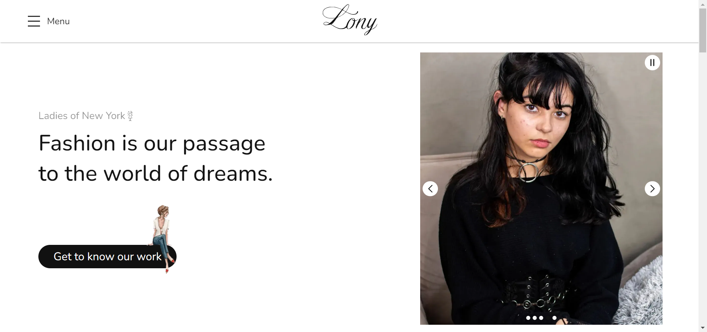

[NEXT__BADGE]: https://img.shields.io/badge/next.js-000000?style=for-the-badge&logo=nextdotjs&logoColor=white
[TYPESCRIPT__BADGE]: https://img.shields.io/badge/typescript-000000?style=for-the-badge&logo=typescript
[SASS__BADGE]: https://img.shields.io/badge/sass-000000?style=for-the-badge&logo=sass
[PROJECT__BADGE]: https://img.shields.io/badge/📱Visit_this_project-000?style=for-the-badge&logo=project
[PROJECT__URL]: https://lony-pink.vercel.app/

# Lony - Ladies of New York (Front-end)💻

![next][NEXT__BADGE]
![typescript][TYPESCRIPT__BADGE]
![sass][SASS__BADGE]

[](https://creativecommons.org/licenses/by-nc-nd/4.0/)

### English 🇬🇧 | [Português 🇧🇷](README_pt-br.md) | [Deutsch 🇩🇪](README_de.md)

[](./public/LonyPageImage_en.png)

## 📌 About

Lony (Ladies of New York) is a project about women's fashion with the initial aim of improving engagement and publicising the work of the girls who make up the group.

In this project you can access their information, their designs and a little of their vision and purpose for the Lony brand, which aims to become one of the best producers of fashion styles on the market.

This project was build in `Next.js` version `14.2.3` using `App Router` render mode.

[![project][PROJECT__BADGE]][PROJECT__URL]

## 🤔 How to run the project in your device?

To clone and run this project in your device, you will need to have [Git](https://git-scm.com/) and [Node.js](https://nodejs.org/en/download/package-manager) installed in your computer. Then, follow these steps from your command line:

```bash
# Clone this repository
$ git clone https://github.com/MatheusJunior2334/Lony.git

# Navigate to the project directory
$ cd lony

# Install the dependencies
$ npm install

# Run the project
$ npm run dev
# Alternatively, you can use:
$ yarn dev
# or
$ pnpm dev
# or
$ bun dev
```

Open [http://localhost:3000](http://localhost:3000) or [http://localhost:3000/home](http://localhost:3000/home) in your browser to see the result.

## 📖 Libraries used

This project uses the following React.js (Next.js) libraries:

- [Swiper.js](https://swiperjs.com/): used to create swiper components and structures
- [Framer Motion](https://www.framer.com/motion/introduction/): utilized for building animations
- [React Intersection Observer](https://www.npmjs.com/package/react-intersection-observer): employed to detect when elements enter or leave the viewport, which works in conjunction with Frame Motion to enhance animations

## ✍ Credits

This project incorporates images and icons from the following sources:

- [Freepik](https://br.freepik.com/): for images
- [Icons8](https://icons8.com/) and [Flaticon](https://www.flaticon.com/): for icons
- [Giphy](https://giphy.com/): for gifs

## 🎨 Creators

<table>
  <tr>
    <td align="center">
      <a href="https://www.linkedin.com/in/matheus-júnior">
        <br>
        <sub>
          <b>Matheus Júnior</b>
          <br />
          <a href="#" title="Code">💻</a>
          <a href="#" title="Design">🎨</a>
        </sub>
      </a>
    </td>
    <td align="center" valign="top">
      <a href="#">
        <br>
        <sub>
          <b>Bianka Araújo</b>
          <br />
          <a href="#" title="Design">🎨</a>
        </sub>
      </a>
    </td>
  </tr>
</table>

## 📝 License

This project is licensed under the [Creative Commons Attribution-NonCommercial-NoDerivatives 4.0 International](https://creativecommons.org/licenses/by-nc-nd/4.0/) Licence