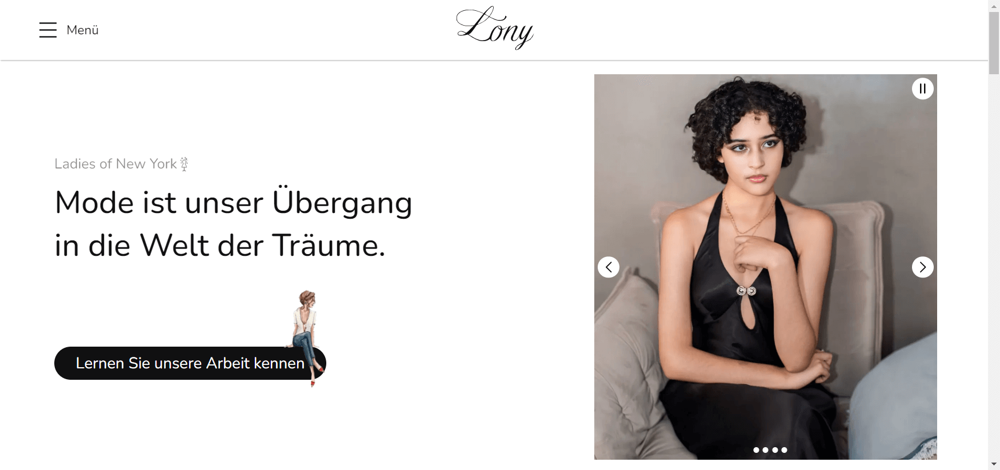

[NEXT__BADGE]: https://img.shields.io/badge/next.js-000000?style=for-the-badge&logo=nextdotjs&logoColor=white
[TYPESCRIPT__BADGE]: https://img.shields.io/badge/typescript-000000?style=for-the-badge&logo=typescript
[SASS__BADGE]: https://img.shields.io/badge/sass-000000?style=for-the-badge&logo=sass
[PROJECT__BADGE]: https://img.shields.io/badge/📱Besuchen_Sie_dieses_Projekt-000?style=for-the-badge&logo=project
[PROJECT__URL]: https://lony-pink.vercel.app/

# Lony - Ladies of New York (Frontend)💻

![next][NEXT__BADGE]
![typescript][TYPESCRIPT__BADGE]
![sass][SASS__BADGE]

[](https://creativecommons.org/licenses/by-nc-nd/4.0/)

### [English 🇬🇧](README.md) | [Português 🇧🇷](README_pt-br.md) | Deutsch 🇩🇪

[](./public/LonyPageImage_de.png)

## 📌 Über

Lony (Ladies of New York) ist ein Projekt über Frauenmode mit dem ursprünglichen Ziel, das Engagement und die Arbeit der Mädchen, die die Gruppe bilden, bekannt zu machen.

In diesem Projekt haben Sie Zugang zu ihren Informationen, ihren Entwürfen und ein wenig von ihrer Vision und ihrem Ziel für die Marke Lony, die zu einem der besten Hersteller von Modestilen auf dem Markt werden soll.

Dieses Projekt wurde in `Next.js` Version `14.2.3` unter Verwendung des `App Router` Rendermodus erstellt.

[![project][PROJECT__BADGE]][PROJECT__URL]

## 🤔 Wie führe ich das Projekt auf meinem Gerät aus?

Um dieses Projekt zu klonen und auf Ihrem Gerät auszuführen, müssen Sie [Git](https://git-scm.com/) und [Node.js](https://nodejs.org/en/download/package-manager) auf Ihrem Computer installiert haben. Führen Sie dann die folgenden Schritte von Ihrer Kommandozeile aus:

```bash
# Klone dieses Repository
$ git clone https://github.com/MatheusJunior2334/Lony.git

# Navigieren Sie zum Projektverzeichnis
$ cd lony

# Installieren Sie die Abhängigkeiten
$ npm install

# Starte das Projekt
$ npm run dev
# Alternativ können Sie verwenden:
$ yarn dev
# oder
$ pnpm dev
# oder
$ bun dev
```

Öffnen Sie [http://localhost:3000](http://localhost:3000) oder [http://localhost:3000/home](http://localhost:3000/home) in Ihrem Browser, um das Ergebnis zu sehen.

## 📖 Verwendete Bibliotheken

Dieses Projekt verwendet die folgenden React.js (Next.js) Bibliotheken:

- [Swiper.js](https://swiperjs.com/): wurde verwendet, um Swiper-Komponenten und Strukturen zu erstellen
- [Framer Motion](https://www.framer.com/motion/introduction/): wurde für die Erstellung von Animationen verwendet
- [React Intersection Observer](https://www.npmjs.com/package/react-intersection-observer): Der Rendermodus wurde verwendet, um zu erkennen, wann Elemente den Viewport betreten oder verlassen, was in Verbindung mit Frame Motion zur Verbesserung von Animationen beiträgt.

## ✍ Kredite

Dieses Projekt enthält Bilder und Symbole aus den folgenden Quellen:

- [Freepik](https://br.freepik.com/): für Bilder
- [Icons8](https://icons8.com/) und [Flaticon](https://www.flaticon.com/): für Icons
- [Giphy](https://giphy.com/): für Gifs

## 🎨 Schöpfer

<table>
  <tr>
    <td align="center">
      <a href="https://www.linkedin.com/in/matheus-júnior">
        <br>
        <sub>
          <b>Matheus Júnior</b>
          <br />
          <a href="#" title="Code">💻</a>
          <a href="#" title="Gestaltung">🎨</a>
        </sub>
      </a>
    </td>
    <td align="center" valign="top">
      <a href="#">
        <br>
        <sub>
          <b>Bianka Araújo</b>
          <br />
          <a href="#" title="Gestaltung">🎨</a>
        </sub>
      </a>
    </td>
  </tr>
</table>

## 📝 Lizenz

Dieses Projekt ist lizenziert unter der [Creative Commons Attribution-NonCommercial-NoDerivatives 4.0 International](https://creativecommons.org/licenses/by-nc-nd/4.0/) Licence