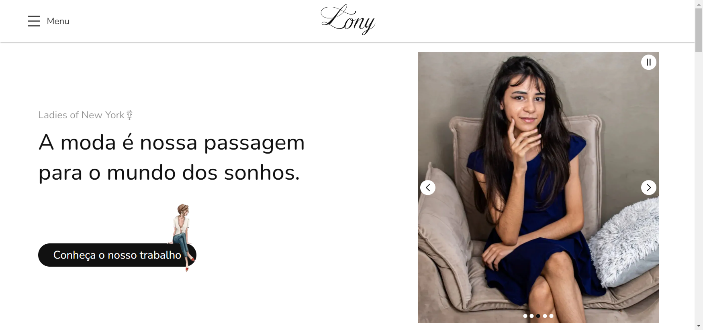

[NEXT__BADGE]: https://img.shields.io/badge/next.js-000000?style=for-the-badge&logo=nextdotjs&logoColor=white
[TYPESCRIPT__BADGE]: https://img.shields.io/badge/typescript-000000?style=for-the-badge&logo=typescript
[SASS__BADGE]: https://img.shields.io/badge/sass-000000?style=for-the-badge&logo=sass
[PROJECT__BADGE]: https://img.shields.io/badge/📱Veja_o_projeto-000?style=for-the-badge&logo=project
[PROJECT__URL]: https://lony-pink.vercel.app/

# Lony - Ladies of New York (Front-end)💻

![next][NEXT__BADGE]
![typescript][TYPESCRIPT__BADGE]
![sass][SASS__BADGE]

[](https://creativecommons.org/licenses/by-nc-nd/4.0/)

### [English 🇬🇧](README.md) | Português 🇧🇷 | [Deutsch 🇩🇪](README_de.md)

[](./public/LonyPageImage_pt-br.png)

## 📌 Sobre

O Lony (Ladies of New York) é um projeto sobre moda feminina com o objetivo inicial de melhorar o engajamento e divulgar o trabalho das garotas que compõem o grupo.

Nesse projeto, você pode acessar suas informações, seus designs e um pouco da visão e do objetivo da marca Lony, que pretende se tornar uma das melhores produtoras de estilos de moda do mercado.

Esse projeto foi desenvolvido em `Next.js` versão `14.2.3` usando o modo de renderização `App Router`.

[![project][PROJECT__BADGE]][PROJECT__URL]

## 🤔 Como rodar esse projeto no seu computador?

Para clonar e rodar esse projeto no seu computador, você precisará ter o [Git](https://git-scm.com/) e o [Node.js](https://nodejs.org/en/download/package-manager) instalados no seu computador. Após isso, siga os passos a seguir pelo terminal do seu computador:

```bash
# Clone esse repositório
$ git clone https://github.com/MatheusJunior2334/Lony.git

# Navegue até o diretório principal do projeto
$ cd lony

# Instale todas as depêndencias do projeto
$ npm install

# Rode o projeto
$ npm run dev
# Como alternativa, você pode utilizar:
$ yarn dev
# ou
$ pnpm dev
# ou
$ bun dev
```

Abra [http://localhost:3000](http://localhost:3000) ou [http://localhost:3000/home](http://localhost:3000/home) no seu navegador de preferência para ver o resultado.

## 📖 Bibliotecas utilizadas

Este projeto utiliza as seguintes bibliotecas do React.js (Next.js):

- [Swiper.js](https://swiperjs.com/): usado para criar componentes e estruturas de swiper
- [Framer Motion](https://www.framer.com/motion/introduction/): usado para construir animações
- [React Intersection Observer](https://www.npmjs.com/package/react-intersection-observer): empregado para detectar quando elementos específicos são renderizados na tela do usuário, além de trabalhar junto ao Framer Motion para melhorar as animações

## ✍ Créditos

Esse projeto incorpora imagens e ícones das seguintes fontes:

- [Freepik](https://br.freepik.com/): para imagens
- [Icons8](https://icons8.com/) e [Flaticon](https://www.flaticon.com/): para ícones
- [Giphy](https://giphy.com/): para gifs

## 🎨 Criadores

<table>
  <tr>
    <td align="center">
      <a href="https://www.linkedin.com/in/matheus-júnior">
        <br>
        <sub>
          <b>Matheus Júnior</b>
          <br />
          <a href="#" title="Programação">💻</a>
          <a href="#" title="Design">🎨</a>
        </sub>
      </a>
    </td>
    <td align="center" valign="top">
      <a href="#">
        <br>
        <sub>
          <b>Bianka Araújo</b>
          <br />
          <a href="#" title="Design">🎨</a>
        </sub>
      </a>
    </td>
  </tr>
</table>

## 📝 Licença

Esse projeto está licenciado sob a Licença [Creative Commons Attribution-NonCommercial-NoDerivatives 4.0 International](https://creativecommons.org/licenses/by-nc-nd/4.0/)